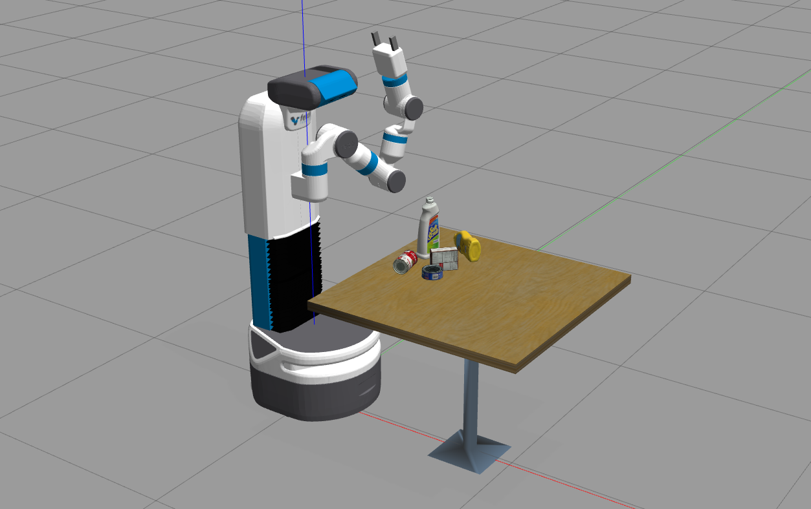
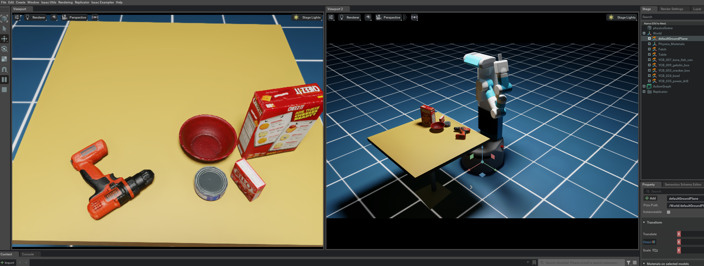

# SceneReplica
Code release for SceneReplica paper: [ArXiv](https://arxiv.org/abs/2306.15620) | [Webpage](https://irvlutd.github.io/SceneReplica/)


## Index

1. [Data Setup](#data-setup): Setup the data files, object models and create a ros workspace with source for the different algorithms
2. [Scene Setup](#reference-scene-setup): Setup the Scene in either simulation or real world
3. [Experiments](#experiments): Run experiments from different algorithms listed 
4. [Misc](#misc): Scene Generation, Video recording, ROS workspace setup

# Data Setup

For ease of use, the code assumes that you have the data files (model meshes, generated scenes etc) under a single directory.
As an example it can be something simple like: `~/Datasets/benchmarking/`

```
~/Datasets
   |--benchmarking
      |--models/
      |--grasp_data
         |--refined_grasps
            |-- fetch_gripper-{object_name}.json
         |--sgrasps.pk
      |--final_scenes
         |--scene_data/
            |-- scene_id_*.pk scene pickle files
         |--metadata/
            |-- meta-00*.mat metadata .mat files
            |-- color-00*.png color images for scene
            |-- depth-00*.png depth images for scene
         |--scene_ids.txt : selected scene ids on each line
```

Follow the steps below, download and extract the zip files:

- Download and extract Graspit generated grasps for YCB models: [`grasp_data.zip`](https://utdallas.box.com/s/jz3fin85v7gyv8ls1tqcs95qoye569g4) as `grasp_data/`
- Download the successful grasps file :  [sgrasps.pk](https://utdallas.box.com/s/ptv8ms4l1kl13kwvvx8w2nn8i7e38stq) This file contains list of possible successful grasp indices for each object.
  - Each object in each scene is checked for a motion plan to standoff position, using all the grasps generated in grasp_data
  - Grasps that provide a valid motion plan are saved w.r.t that object and corresponding scene. 
  - the algorithm first iterates throught these successful grasps and the rest next, in the actual experiments. 
- Download and extract Scenes Data : [`final_scenes.zip`](https://utdallas.box.com/s/47foq3nri7ob3gym853ynwrenfvv6oix) as `final_scenes/`
- [*Optional*] Download and extract YCB models for gazebo and Isaac Sim (using `textured_simple` meshes): [`models.zip`](https://utdallas.box.com/s/zkt115qz5d5or0h1ehkzafnut8of4571)
  - Only needed if you want to play around with the YCB models in Gazebo or Isaac Sim simulation
  - This already includes the edited model for cafe table under the name `cafe_table_org`
  - For Gazebo, create a symlink to the gazebo models into your Fetch Gazebo src/models/: `~/src/fetch_gazebo/fetch_gazebo/models`


# Reference Scene Setup

Scene Idxs: `10, 25, 27, 33, 36, 38, 39, 48, 56, 65, 68, 77, 83, 84, 104, 122, 130, 141, 148, 161`

## Real World Usage

Setup the data folders as described and follow the steps below:

1. Setup the YCB scene in real world as follows. `--datadir` is the dir with `color-*.png, depth-*.png, pose-*.png and *.mat` info files. Using the above Data Setup, it should be the folder: `final_scenes/metadata/`
   ```shell
   cd src
   python setup_robot.py # will raise torso and adjust head camera lookat
   python setup_ycb_scene.py --index [SCENE_IDX] --datadir [PATH TO DIR]
   ```

2.  `setup_ycb_scene.py` starts publishing an overlay image which we can use as a reference for real world object placement

3. Run rviz to visualize the overlay image and adjust objects in real world
    ```Shell
    rosrun rviz rviz -d config/scene_setup.rviz
    ```
**Details about real world setup**:
- We use a Fetch Mobile Manipulator for the experiments
- Table height used for the experiments was 0.75 meters
  - Using a height adjustable table is preferred to ensure this match
- Sufficient lighting for the scene is also assumed. The performance of perception algorithms may get affected with different lighting

**Usage with other robots**:
The metadata files (specifically the color scene-overlay reference images) are obtained using a Fetch robot in simulation. So the same images will not work for scene replication unless your robot's camera (either internal or external camera) have the same pose. In order to recreate the same scene and generate new overlay images for your setup, you can follow these steps:

- Recreate the setup in simulation where you can fix the camera (same pose as to be used in real world). If possible, try to match Fetch robot setup which we use (reference: `src/setup_robot.py` which adjusts the camera lookat position)
- Spawn the desired in simulation using `setup_scene_sim.py` reference as a reference. This should spawn the objects in correct locations in the simulation.
- Use the `src/scene_generation/save_pose_results.py` as a reference to save your own version of overlay images. They might look a bit different but the end goal of recreating the scene in real world should work as before.
- Once you have the overlay images, the entire pipeline works as document where you re-create the scene in real world using the overlay images (make sure you are not using the ones for Fetch robot). This assumes that the camera pose in real world is same as the one used in simulation.


## Gazebo (Simulation) Usage

[Optional]

0. Download the models of YCB objects as described above. Make sure creating a symlink to the gazebo models into your Fetch Gazebo src/models/: `~/src/fetch_gazebo/fetch_gazebo/models`

1. launch the tabletop ycb scene with only the robot
    ```Shell
    roslaunch launch/just_robot.launch
    ``` 
  
2. Setup the desired scene in Gazebo:
   ```Shell
   cd src/
   python setup_scene_sim.py
   ```
   Preferred that all data is under `~/Datasets/benchmarking/{scene_dir}/`(e.g. "final_scenes"). 
   It runs in a loop and asks you to enter the scene id at each iteration. Loads
   the objects in gazebo and waits for user confirmation before next scene.

3. To use MoveIt with Gazebo for the Fetch robot, start MoveIt by
    ```Shell
    roslaunch launch/moveit_sim.launch
    ```

4. Try the model-based grasping as described below in Gazebo

 

## NVIDIA Isaac Sim (Simulation) Usage

[Optional]

0. Download the models of YCB objects as described above, and make sure you have [isaac_sim](https://developer.nvidia.com/isaac-sim) correctly installed
  
1. Setup the desired scene in Isaac Sim:
   ```Shell
   cd src/
   ./$ISAAC_ROOT/python setup_scene_isaac.py --scene_index $scene_index
   ```

2. To use MoveIt with Isaac Sim for the Fetch robot, download and setup the [isaac_sim_moveit](https://github.com/IRVLUTD/isaac_sim_moveit) package. Start the controllers and the MoveIt by
    ```Shell
    cd isaac_sim_moveit/launch
    roslaunch fetch_isaac_controllers.launch
    roslaunch fetch_isaac_moveit.launch
    ```

3. Try the model-based grasping as described below in Isaac Sim. For example,
    ```Shell
    cd src
    python3 bench_model_based_grasping.py --data_dir=../data/ --scene_idx 68 --pose_method isaac --obj_order nearest_first
    ```



# Experiments

- We use a multi-terminal setup for ease of use (example: [Terminator](https://gnome-terminator.org/))
- In one part, we have the perception repo and run bash scripts to publish the required perception components (e.g., 6D Object Pose or Segmentation Masks)
- We also have a MoveIt motion planning launch file as for the initial experiments, we have only benchmarked against MoveIt
- Lastly, we have a rviz visualization terminal and a terminal to run the main grasping script.
- Ensure proper sourcing of ROS workspace and conda environment activation.

## Model Based Grasping

1. Start the appropriate algorithm from below in a separate terminal and verify if the required topics are being published or not?

2. Once verified, `cd src/` and you can start the grasping script: Run `python bench_model_based_grasping.py`. See its command line args for more info.

- `--pose_method` : From {"gazebo", "isaac", "posecnn", "poserbpf"}
- `--obj_order` : From {"random", "nearest_first"}
- `--scene_idx` : Scene id for which you'll test the algorithm

### PoseCNN
Reference repo: [`IRVLUTD/PoseCNN-PyTorch-NV-Release` ](https://github.com/IRVLUTD/PoseCNN-PyTorch-NV-Release/tree/fetch_robot)

- `cd PoseCNN-PyTorch-NV-Release`
- `conda activate benchmark`
- term1: `rosrun rviz rviz -d ./ros/posecnn.rviz`
- term2: `./experiments/scripts/ros_ycb_object_test_fetch.sh $GPU_ID`
- More info: check out [README](https://github.com/IRVLUTD/PoseCNN-PyTorch-NV-Release/blob/fetch_robot/README.md)

### PoseRBPF
Reference repo: [`IRVLUTD/posecnn-pytorch`](https://github.com/IRVLUTD/posecnn-pytorch)

- `cd posecnn-pytorch`
- `conda activate benchmark`
- term1: `./experiments/scripts/ros_ycb_object_test_subset_poserbpf_realsense_ycb.sh $GPU_ID $INSTANCE_ID`
- term2: `./experiments/scripts/ros_poserbpf_ycb_object_test_subset_realsense_ycb.sh $GPU_ID $INSTANCE_ID`
- Rviz visualization: `rviz -d ros/posecnn_fetch.rviz`
- Check out [README](https://github.com/IRVLUTD/posecnn-pytorch#running-on-realsense-cameras-or-fetch) for more info


## Model Free Grasping

1. Start the appropriate algorithm from below in a separate terminal and verify if the required topics are being published or not?
   - First run the segmentation script
   - Next run the 6dof grasping script
   - Finally run the grasping pipeline script

2. Once verified, you can start the grasping script: `cd src/` and run `python bench_6dof_segmentation_grasping.py`. See its command line args for more info.
   - `--grasp_method` : From {"graspnet", "contact_gnet"}
   - `--seg_method` : From {"uois", "msmformer"}
   - `--obj_order` : From {"random", "nearest_first"}
   - `--scene_idx` : Scene id for which you'll test the algorithm

### Segmentation Methods

#### UOIS
Reference repo: [`IRVLUTD/UnseenObjectClustering`](https://github.com/IRVLUTD/UnseenObjectClustering)

- `cd UnseenObjectClustering`
- seg code: `./experiments/scripts/ros_seg_rgbd_add_test_segmentation_realsense.sh $GPU_ID`
- rviz: `rosrun rviz rviz -d ./ros/segmentation.rviz`

#### MSMFormer
Reference repo: [`YoungSean/UnseenObjectsWithMeanShift`](https://github.com/YoungSean/UnseenObjectsWithMeanShift)

- `cd UnseenObjectsWithMeanShift`
- seg code: `./experiments/scripts/ros_seg_transformer_test_segmentation_fetch.sh $GPU_ID`
- rviz: `rosrun rviz rviz -d ./ros/segmentation.rviz`

### 6DOF Point Cloud based Methods

#### 6DOF GraspNet
Reference repo: [`IRVLUTD/ pytorch_6dof-graspnet`](https://github.com/IRVLUTD/pytorch_6dof-graspnet)

- `cd pytorch_6dof-graspnet`
- grasping code: `./exp_publish_grasps.sh` (chmod +x if needed)

#### Contact GraspNet
Reference repo: [`IRVLUTD/contact_graspnet`](https://github.com/IRVLUTD/contact_graspnet)

**NOTE:** This has a different conda environment (`contact_graspnet`) than others due to a tensorflow dependency.
Check the `env_cgnet.yml` env file in the reference repo.

- `cd contact_graspnet`
- `conda activate contact_graspnet`
- Run `run_ros_fetch_experiment.sh` in a terminal. 
  - In case GPU usage is too high, (check via `nvidia-smi`): reduce the number for `--forward_passes` flag in shell script
  - If you dont want to see generated grasp viz, remove the `--viz` flag from shell script  


# Misc

## Scene Generation
We utilize a Gazebo simulation envrionment to generate the scenes. The `gazebo_models` meshes and offline grasp dataset (`grasp_data`) are used in this process. All the scripts for scene generation and final scene selection are located in `src/scene_generation/` with a detailed [README](src/scene_generation/README.md) for the process.


## Usage of the Video Recorder    
1. Launch the RealSense camera
    ```Shell
    roslaunch realsense2_camera rs_aligned_depth.launch tf_prefix:=measured/camera
    ``` 
  
2. Run the video recording script: `src/video_recorder.py`
    ```Shell
    cd src/
    python3 video_recorder.py -s SCENE_ID -m METHOD -o ORDER [-f FILENAME_SUFFIX] [-d SAVE_DIR]
    ```
    To stop capture, `Ctrl + C` should as a keyboard interrupt.


## ROS Setup
We used the following steps to setup our ROS workspace. Install the following dependencies into a suitable workspace folder, e.g. `~/bench_ws/`

  **1.** Install ROS Noetic 

     Install using the instructions from here -  http://wiki.ros.org/noetic/Installation/Ubuntu
  
  **2.** Setup ROS workspace
  
     Create and build a ROS workspace using the instructions from here - http://wiki.ros.org/catkin/Tutorials/create_a_workspace
  
  **3.** Install fetch ROS, Gazebo packages and custom scripts
  
  Install packages using following commands inside the src folder 
  
    `git clone -b melodic-devel https://github.com/ZebraDevs/fetch_ros.git`

    `git clone –branch gazebo11 https://github.com/fetchrobotics/fetch_gazebo.git`

    `git clone https://github.com/ros/urdf_tutorial`

    `git clone https://github.com/IRVLUTD/SceneReplica.git`
  
  If you see missing package erros: Use `apt install` for `ros-noetic-robot-controllers` and `ros-noetic-rgbd-launch`.
  
**Gazebo or MoveIt Issues**:

- `alias killgazebo="killall -9 gazebo & killall -9 gzserver  & killall -9 gzclient"` and then use `killgazebo` command to restart
- Similarly for MoveIt, you can use `killall -9 move_group` if `Ctrl-C` on the moveit launch process is unresponsive
